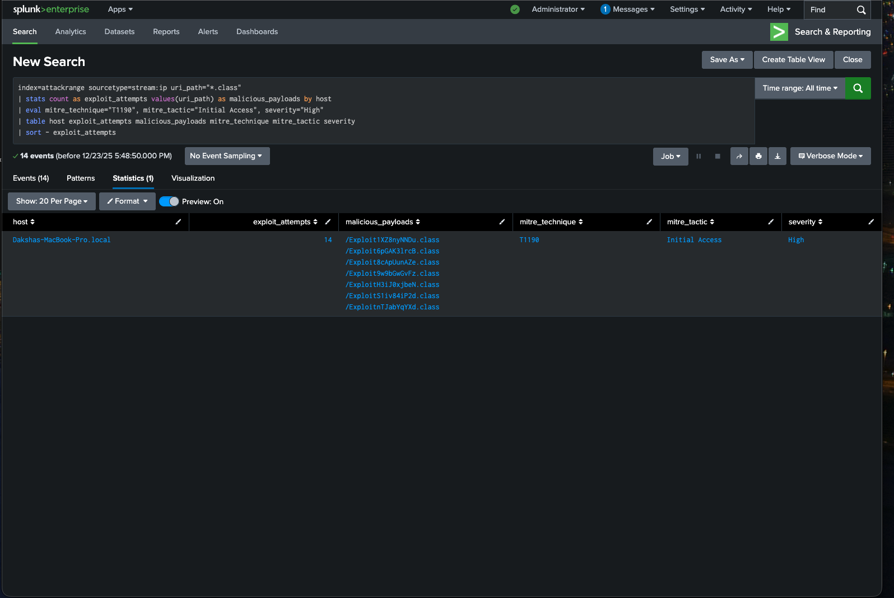
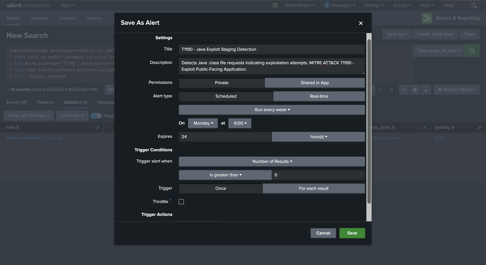
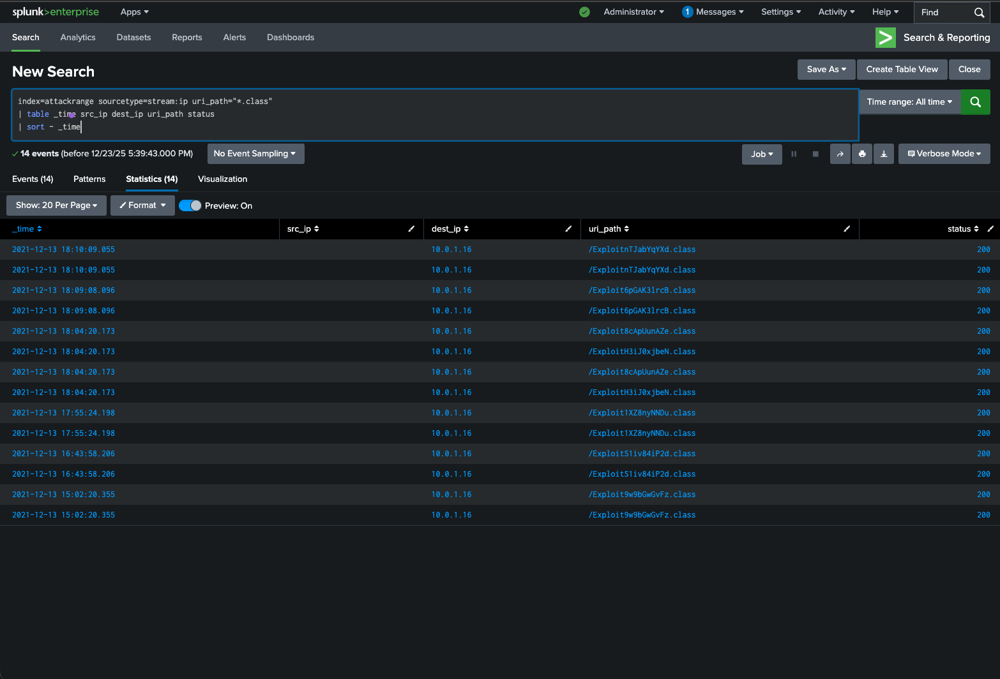
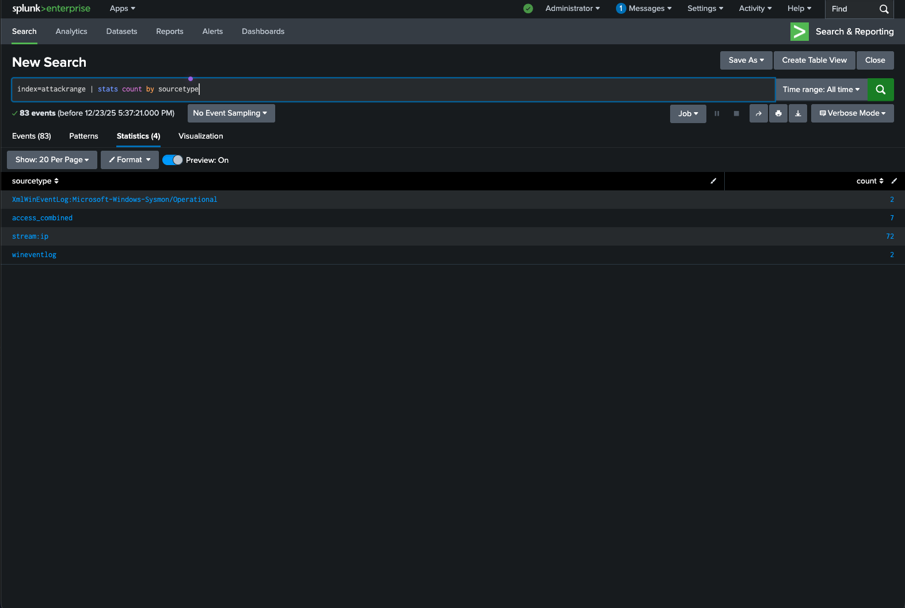

# MITRE-ATTCK-Splunk-Detections
# 🔍 MITRE ATT&CK Threat Detection with Splunk

Detection engineering project focused on identifying Java-based exploitation attempts using Splunk Enterprise. The queries in this repository detect malicious `.class` file requests commonly associated with Log4Shell (CVE-2021-44228) and similar JNDI injection attacks targeting public-facing applications.

All detections are mapped to the MITRE ATT&CK framework and tested against the [Splunk Attack Range](https://github.com/splunk/attack_range) environment.

---

## 🎯 Detection: T1190 — Exploit Public-Facing Application

This detection identifies HTTP requests for Java `.class` files, which indicate an attacker attempting to load malicious code onto a vulnerable server. During Log4Shell attacks, compromised applications would reach out to attacker-controlled servers to download and execute these payloads.

The query aggregates exploit attempts by host, extracts the malicious payload paths, and automatically tags results with the corresponding MITRE technique and severity level.



The detection is configured as a scheduled alert with weekly runs and real-time monitoring capability. When triggered, it fires for each result exceeding the threshold.



---

## 📊 Queries

### T1190 Java Exploit Detection

Detects and aggregates Java exploit attempts with MITRE ATT&CK enrichment.

```spl
index=attackrange sourcetype=stream:ip uri_path="*.class"
| stats count as exploit_attempts values(uri_path) as malicious_payloads by host
| eval mitre_technique="T1190", mitre_tactic="Initial Access", severity="High"
| table host exploit_attempts malicious_payloads mitre_technique mitre_tactic severity
| sort - exploit_attempts
```

### Exploit Traffic Timeline

Provides a forensic timeline of exploit traffic for incident investigation, showing source and destination IPs alongside the requested payload paths.

```spl
index=attackrange sourcetype=stream:ip uri_path="*.class"
| table _time src_ip dest_ip uri_path status
| sort - _time
```



### Data Source Inventory

Identifies all available log sources ingested into the environment. Useful for validating data coverage and planning additional detections.

```spl
index=attackrange 
| stats count by sourcetype
```



---

## 📁 Data Sources

The Attack Range environment provides multiple log sources for detection development:

| Source Type | Events | Description |
|-------------|--------|-------------|
| `stream:ip` | 72 | Network traffic capture |
| `access_combined` | 7 | Web server access logs |
| `wineventlog` | 2 | Windows event logs |
| `Sysmon/Operational` | 2 | Endpoint telemetry |

---

## 🛠️ Setup

To use these detections, import the SPL files from the `queries/` folder into Splunk Search & Reporting. Save them as scheduled reports or alerts depending on your use case. For production environments, adjust the index name and scheduling frequency to match your infrastructure.

The queries were developed and tested using the [Splunk Attack Range](https://github.com/splunk/attack_range), which simulates realistic attack scenarios for detection engineering.

---

## 🗺️ MITRE ATT&CK Coverage

| Technique | Name | Tactic | Status |
|-----------|------|--------|--------|
| T1190 | Exploit Public-Facing Application | Initial Access | ✅ Implemented |

---

## 📚 References

- [MITRE ATT&CK T1190](https://attack.mitre.org/techniques/T1190/)
- [Log4Shell — CVE-2021-44228](https://nvd.nist.gov/vuln/detail/CVE-2021-44228)
- [Splunk Attack Range](https://github.com/splunk/attack_range)
- [Splunk Security Content](https://github.com/splunk/security_content)

---

## 📬 Contact

**Daksha Mudumbai**  
[LinkedIn](https://linkedin.com/in/daksha-mudumbai/) · [GitHub](https://github.com/dakshamudumbai) · mudumbaid@gmail.com
